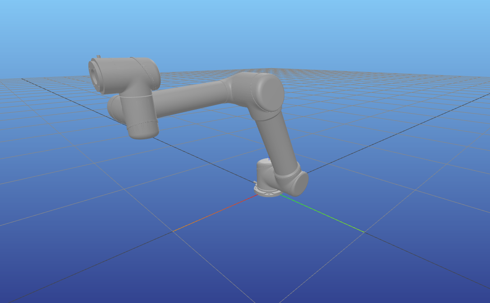

# Impedance Control Benchmark
Welcome to the Impedance Control Benchmark project. This project is dedicated to characterizing the impedance control method in robotics.



The primary focus is on proposing a Python-based toolset that relies on the Pinocchio rigid body dynamics library (Python wrappers), Numpy, and Matplotlib. 
The aim is to increase the reachability using this programming language without losing the theoretical background.

## Installation and Dependencies

The source code was developed on Ubuntu 22.04 with:

1. Python 3.10
2. [Pinocchio](https://stack-of-tasks.github.io/pinocchio/download.html#Install_1) 2.6.20
3. Matplotlib 3.6.2
4. Numpy 1.23.5

Versions are recommended, but not strictly.
Once installed these dependencies, clone the repo:
```sh
git clone git@github.com:leggedrobotics-usp/impedance_control_benchmark.git
```
This is it!

## Usage

The simulation setup was design to rely on the `MeshcatVisualizer` running
on a web browser. Once the simulation starts a new window on your browser will
display the robot arm and peform the movement according to the [simulation script](./controllers/impedance_6dof.py).
Run the simulation on interactive mode for better experience:

```sh
python3 -i controllers/impedance_6dof.py
```

Simulation logs are stored in the [data](./data/) directory. Graphs using these logs can be seen on [plots](./plots/).
Please consider this directory struct for your usage and development. Data files are here for exemplification only. 
**Do not open PR with data/log files.**

## Contributing

- Fork the repo
  - <https://github.com/leggedrobotics-usp/impedance_control_benchmark/fork>
- Check out a new branch and name it regarding your changes:
  - ````bash
    git checkout -b <feat-branch-name>
    ````
- Commit your changes with relevant and proper messages;

- Push to your fork branch;

- Open a pull request (PR)!

See [CONTRIBUTING](./CONTRIBUTING.md) for extended guidelines.

## License

GNU GPLv3

Permissions of this strong copyleft license are conditioned on making available the complete source code of licensed works and modifications, which include larger works using a licensed work, under the same license. 
Copyright and license notices must be preserved. Contributors provide an express grant of patent rights.

## Funding

The source code and associated publications were developed with the support from the São Paulo Research Foundation (FAPESP), grant numbers 2018/15472-9, and 2021/09244-6.
